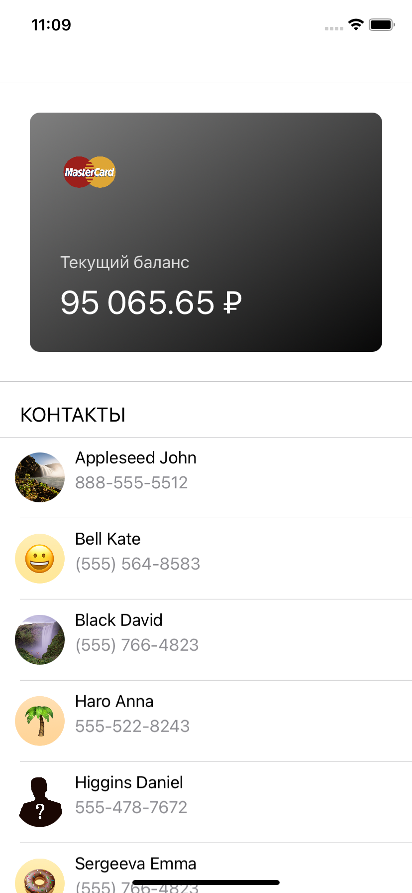
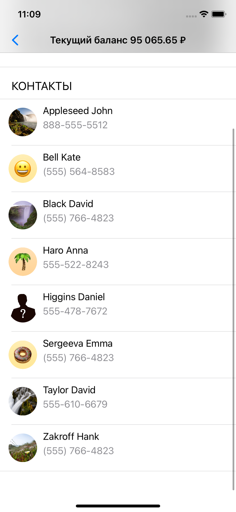
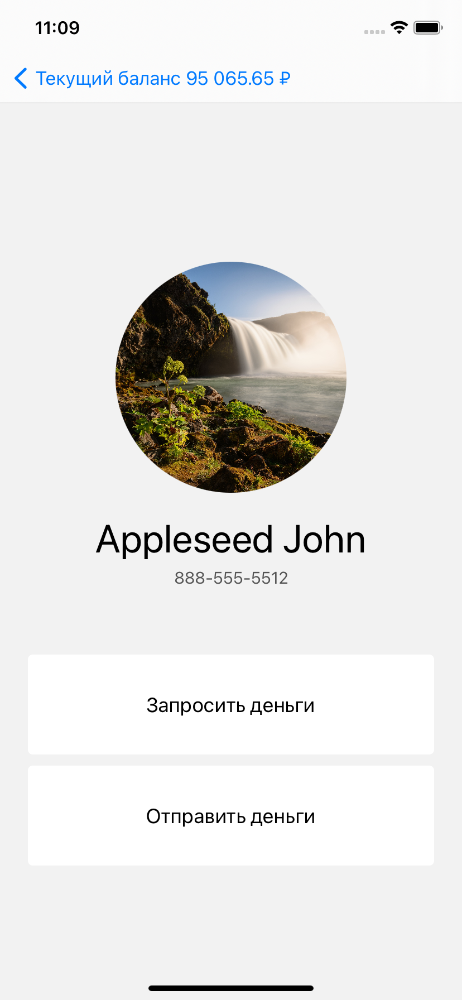
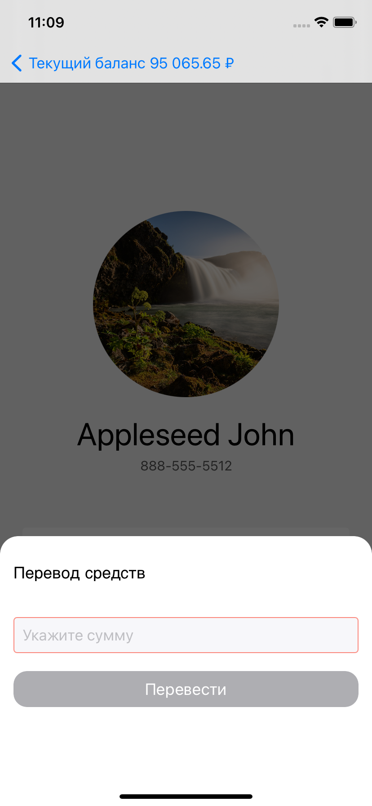
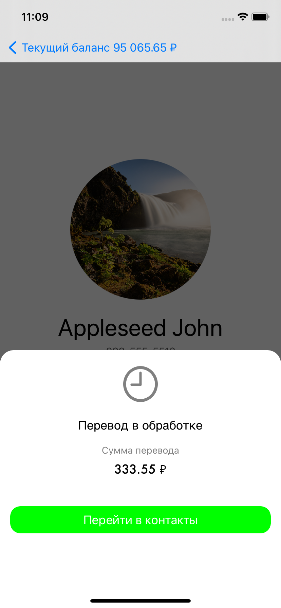
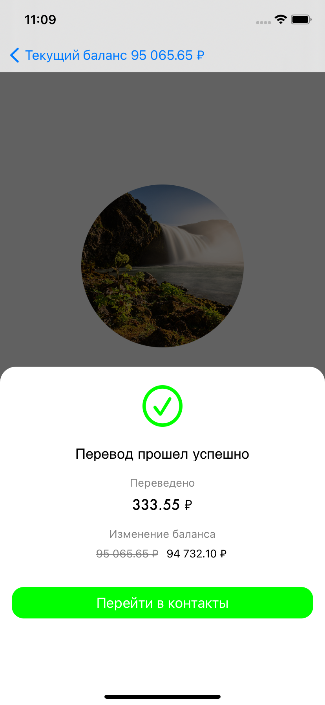
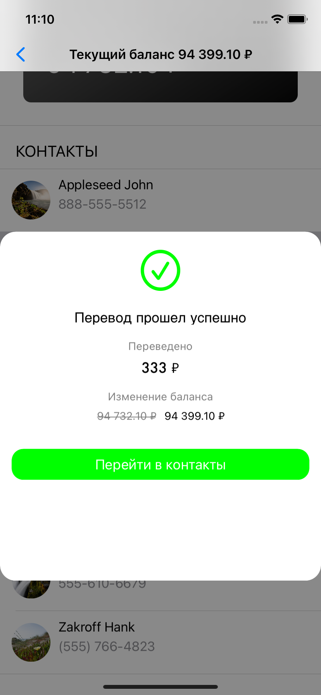

# MoneyTransfer

This application that simulates transfers and requests money for contacts from an address book.

# Input information

● The start screen of the application displays the current balance (100,000 rubles at the first launch) and a list of contacts from the address book 

● When you switch to a contact, a contact page is displayed with the ability to perform 2 actions (transfer or request money, by default - 1,000 rubles)

● When an action is performed, the application simulates a request to the server

● When a local notification arrives, the balance is updated and a success screen is displayed 

● If the application was active at the time of the local notification, the success screen is shown in a curtain pop-up from the bottom over any screen 

# Rules

● Architecture: Viper

● SOLID

● UnitTests

● language: Swift

● platform: Ios 13.2+

# ScreenSchots

​

​

​

​

​

​

​
